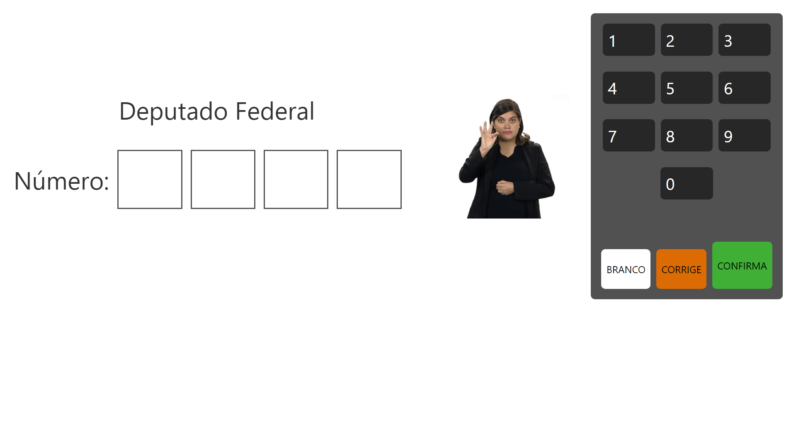
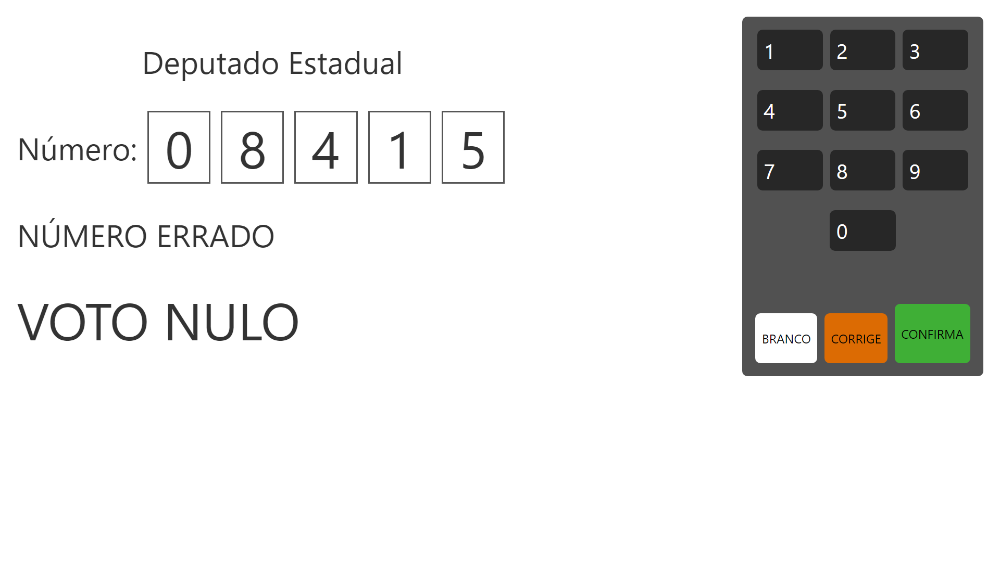
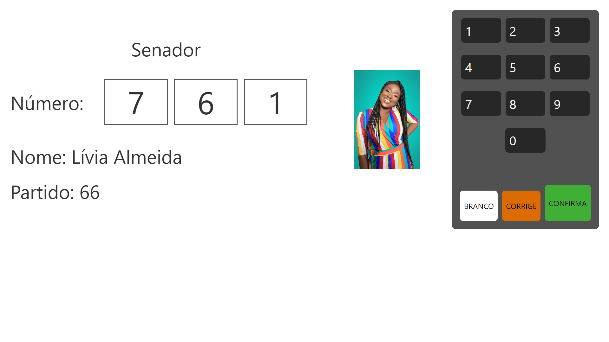
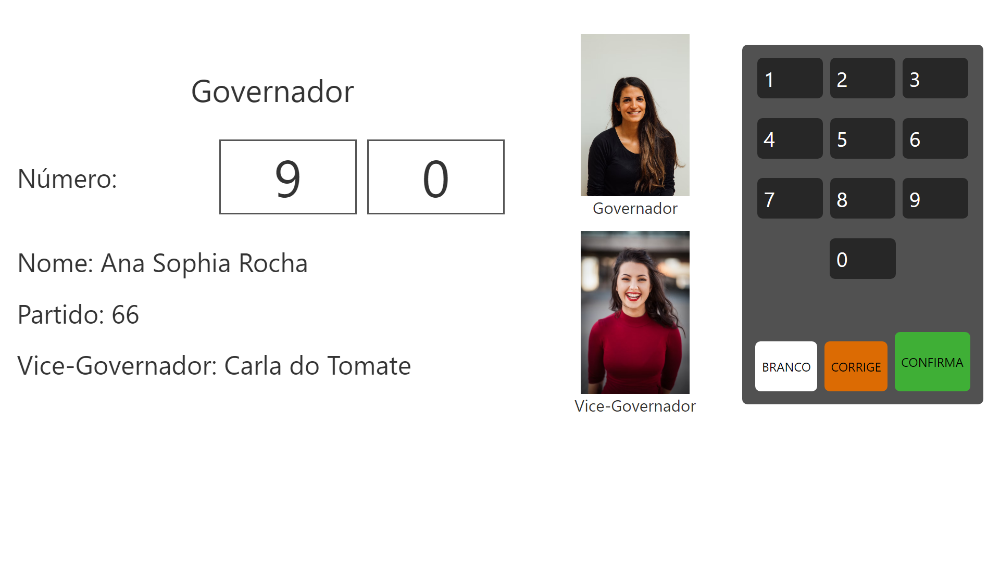
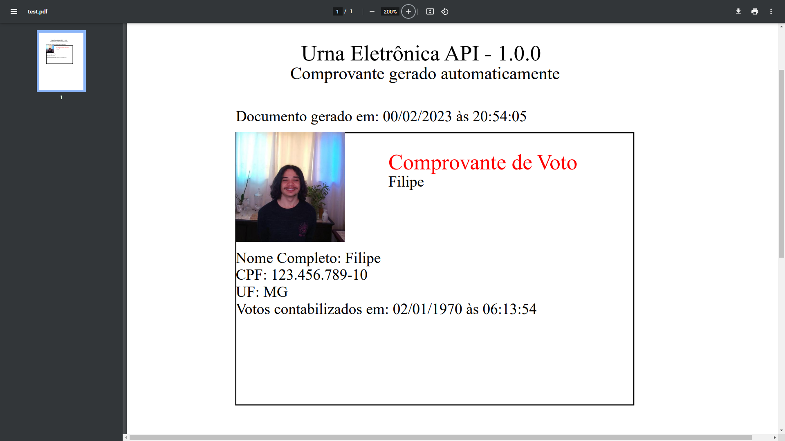

# Sistema Urna Eletrônica

## Trabalho desenvolvido durante a disciplina Engenharia de Software 2 - UFOP. Backend da aplicação desenvoldido por meu companheiro de equipe <a href="https://github.com/Filipey" target="_blank">Filipe Moura</a>, repositório da aplicação backend disponivel <a href="https://github.com/Filipey/urna-eletronica-api" target="_blank">aqui</a>.

## Primeiramente, vamos discutir como executar 🏃‍

```bash

# Antes de tudo, acesse o repositorio backend do Felipe Moura e siga as instruções para instalar o backend da aplicação

-> Acesse: https://github.com/Filipey/urna-eletronica-api

# Feito isso, clone este repositório
$ git clone https://github.com/diogoleite87/urna-eletronica-client

# Acessa a pasta do frontend no terminal
$ cd urna-eletronica-client

# Instale as dependências
$ yarn

# Execute a aplicação
$ yarn dev

# A aplicação iniciará na porta que estiver disponível em sua máquina
# Execute o backend seguindo o tutorial disponível no repositório do Felipe Moura

```

# Ciclo de Votação

## Tela Inicial

### Nessa etapa, insira o CPF de um eleitor que ainda não tenha votado.


## Deputado Federal

### Primeiro passamos pela votação para Deputado Federal



## Deputado Estadual

### Agora vamos para votação para Deputado Estadual, aproveitando para mostrar a possibilidade de VOTO NULO quando um numero de candidato invalido é inserido



## Senador

### Passando pela votação de Senador, aproveito para demonstrar como a urna se comporta diante de um número válido



## Governador

### Seguindo a msm ideia, chegamos na votação para Governador



## Presidente

### Por último e não menos importante, votação para Presidente


## FIM

### No fim, os votos são contabilizados e o eleitor fica indisponivel para votar novamente


## Comprovante

### Podemos emitir o comprovante PDF de votação do eleitor quando o mesmo concluir a votação


